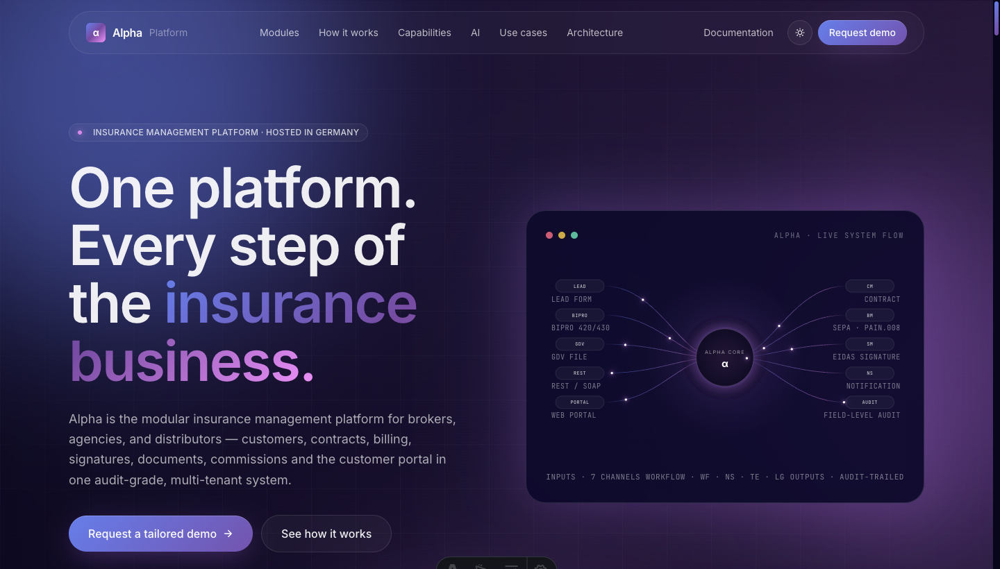
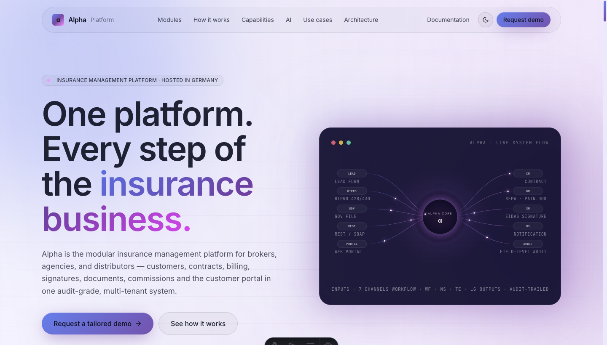

# Alpha Platform — product showcase

Single-page product website for the Alpha Platform, an enterprise insurance distribution
platform with 64+ modules covering customers, contracts, billing, signatures, documents,
commissions and the customer portal.

<p align="center">
  
  
</p>

## Stack

- **Astro 5** — static-first, zero JS bundle by default
- **Tailwind CSS 3** — utility-first styling, custom keyframes
- **GSAP 3** — available for animation, currently used sparingly (most motion is SMIL `<animateMotion>` and CSS)
- **CSS variable theme system** — light + dark, no-flash inline init from `localStorage` / `prefers-color-scheme`

## Sections

Hero · Problem → Solution · Modules (periodic-table grouping) · 8-step lifecycle timeline ·
15 capabilities · AI Cognitive Backend (live NL → QL terminal demo) · Use cases ·
Architecture & trust pillars · CTA.

## Run it

```bash
npm install
npm run dev      # http://localhost:4321
npm run build    # → ./dist (static)
npm run preview  # serve ./dist
```

## Project layout

```
src/
├── components/   # one .astro per section + Nav, Footer, ThemeToggle, SystemFlow
├── data/         # module catalog (8 groups, 47+ modules)
├── layouts/      # root Layout with SEO meta + theme init
├── pages/        # index.astro composes the sections
└── styles/       # global.css — design tokens + theme overrides
```
